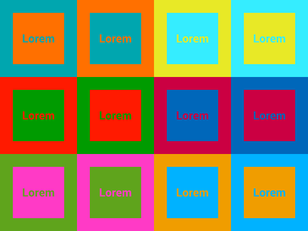
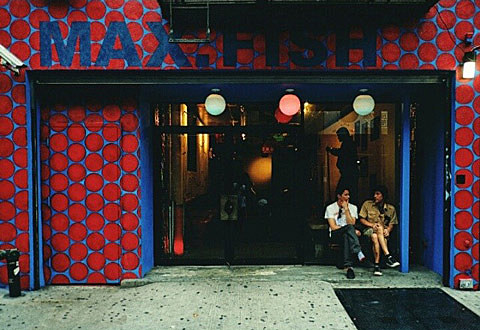

# Mechaneyes: Portfolio 22SS

  
 
 

### [mechaneyes.com](http://mechaneyes.com/)

 
 

## Taxonomy

  

### Ski Resorts and their Mountains

  

  

The taxonomy I've employed is based on ski resorts near Lake Tahoe and the mountains within them. Each interest of mine is defined by a resort, and the projects within interest rest on the tops of those mountains.

  
 
 
  

## Navigation/Interaction

  

  

To navigate the site I'm using Mapbox GL JS' built-in [cluster](https://docs.mapbox.com/mapbox-gl-js/style-spec/sources/#geojson-cluster) functions to visualize points in a [circle layer](https://docs.mapbox.com/mapbox-gl-js/style-spec/layers/#circle) as clusters.

  

  

For customizing and styling the clusters themselves I'm basing my work on this example: [Set Mapbox cluster icons based on cluster contents](https://medium.com/@droushi/mapbox-cluster-icons-based-on-cluster-content-d462a5a3ad5c)

  

  

General clustering was based on this example: [Create and style clusters](https://docs.mapbox.com/mapbox-gl-js/example/cluster/)

  
 
 
  

## Design

  

  

### [Why You Should Avoid Vibrating Color Combinations](https://webdesign.tutsplus.com/articles/why-you-should-avoid-vibrating-color-combinations--cms-25621)

  

  

  

  

For color combinations I'm purposely employing colors that vibrate against each other. As the article above describes, these types of combinations are usually not encouraged. However I like the effect and as I'm using it sparingly so I'm actually happy with the output.

  

  

The first time I saw this vibration effect was at [Max Fish](https://maxfishbar.com/) on Orchard.

  

  

  

 
 

## Notes

  

  

### GitHub repo: [mechaneyes-exhibit](https://github.com/rayweitzenberg/mechaneyes-exhibit)

  

This project was bootstrapped with [Create React App](https://github.com/facebook/create-react-app).
